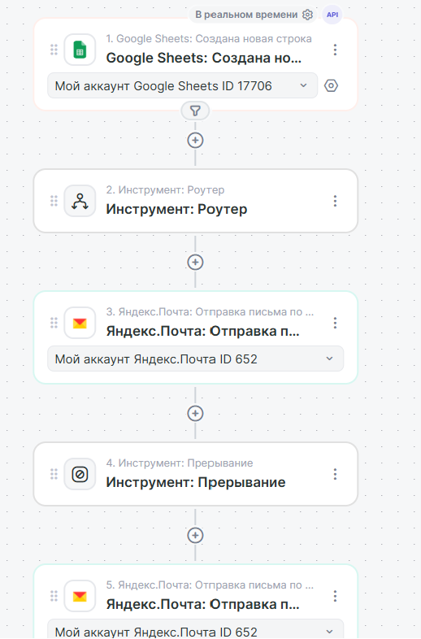

# 🤖 AI HR-Ассистент: автоматизация найма на базе Albato и GigaChat

MVP-решение для автоматизации первичного рекрутинга. Система самостоятельно обрабатывает входящие письма, анализирует резюме с помощью ИИ и управляет коммуникацией с кандидатами.

---

## 🎯 Реализованная задача
Автоматизация воронки обработки откликов: от момента получения письма до внесения данных в базу и отправки ответа. Проект решает проблему ручного разбора почты и первичного скрининга Hard Skills.

---

## 🛠 Технологический стек
* **Платформа автоматизации:** Albato.
* **Искусственный интеллект:** GigaChat (модель Gigachat-2-Max).
* **База данных:** Google Sheets.
* **Почтовый сервис:** Яндекс.Почта (IMAP/SMTP).

---

## ⚙️ Функционал и логика сценариев

Проект реализован через два независимых сценария для обеспечения стабильности и масштабируемости:

### Сценарий №1: Прием резюме и интеллектуальный метчинг
1. **Триггер:** получение нового письма в Яндекс.Почте.
2. **AI-экстракция:** передача текста письма в GigaChat для извлечения данных (ФИО, навыки, опыт) в формате JSON.
3. **Фильтрация (Junior-фильтр):** - кандидаты уровня **Junior** автоматически отсеиваются и сохраняются на лист «Junior» в Google Sheets. Это экономит ресурсы на проведение дорогостоящего метчинга.
   - Кандидаты **Middle/Senior** проходят дальше.
4. **Метчинг:** GigaChat сопоставляет опыт кандидата с вакансией и выставляет Score (0-100).
5. **Запись:** данные сохраняются в таблицу «Кандидаты».

### Сценарий №2: Автоматическая обратная связь
Запускается при появлении новой строки в Google Sheets:
* **Ветка "Успех" (Score ≥ 65):** отправка письма с подтверждением интереса.
* **Ветка "Отказ" (Score < 65):** отправка вежливого автоматического отказа.
* **Завершение:** инструмент «Прерывание» исключает дублирование операций.

---

## 🖼 Схемы автоматизации

### Сценарий №1: Прием резюме и метчинг

### Сценарий №2: Автоматическая обратная связь

---

## 🚀 Инструкция по развертыванию
1. Импортируйте сценарии в аккаунт Albato.
2. Подключите API-ключи GigaChat и настройте интеграции с Яндекс.Почтой и Google Sheets.
3. Создайте в Google Таблице листы: `Вакансии`, `Кандидаты`, `Junior`.
4. В сценарии №1 укажите системный промпт для GigaChat из папки проекта.

---
## Лицензия

MIT License

---

## 📞 Контакты

Если вам нужно внедрить подобное решение или автоматизировать бизнес-процессы с помощью AI:
* **Telegram:** [@Margo_AI_Engineer](https://t.me/Margo_AI_Engineer)
* **GitHub:** [zuzinamd-creator](https://github.com/zuzinamd-creator)
